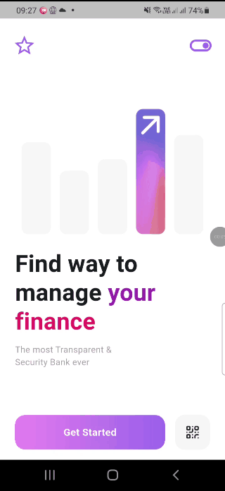

# Finance App

A prototype financial application build using flutter. The application does not need internet connection, i use mock data to simulate data fetching.

## Demo


## Release
There are already a released version available to download [here](https://github.com/Mirzaadr/flutter-finance-app/releases/tag/v1.0.0)
1. download ```app-release.zip```
2. extract ```app-release.apk``` and install to android device
3. run the app

## Getting Started

This project is a starting point for a Flutter application.

A few resources to get you started if this is your first Flutter project:

- [Lab: Write your first Flutter app](https://docs.flutter.dev/get-started/codelab)
- [Cookbook: Useful Flutter samples](https://docs.flutter.dev/cookbook)

For help getting started with Flutter development, view the
[online documentation](https://docs.flutter.dev/), which offers tutorials,
samples, guidance on mobile development, and a full API reference.
